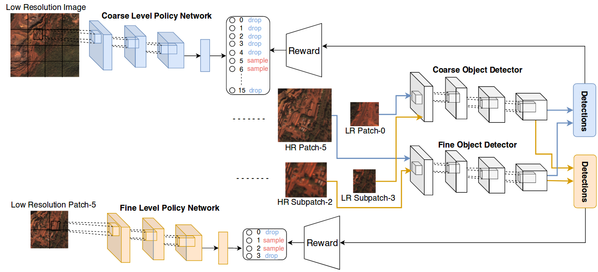

# Efficient Object Detection in Large Images with Deep Reinforcement Learning

This repository contains PyTorch implementation of our IEEE WACV20 paper on Efficient Object Detection in Large
Images with Deep Reinforcement Learning. Our paper can be found [here](http://openaccess.thecvf.com/content_WACV_2020/papers/Uzkent_Efficient_Object_Detection_in_Large_Images_Using_Deep_Reinforcement_Learning_WACV_2020_paper.pdf).



## Object Detectors
### Training Object Detectors
We train two different detectors: (1) **Fine level** object detector and (2) **Coarse level** object detector. To parameterize
the detectors, we use the YOLO-v3 network, however, you can use a detector of your choice. We use [this repository](https://github.com/eriklindernoren/PyTorch-YOLOv3) to train the
fine and coarse level detectors. In the paper, we use **320x320**px and **64x64**px images to train the fine and coarse level detectors. The coarse images represented with **64x64**px is the downsampled version of the high resolution images represented with 320x320 px. Each image ideally should represent a window of the large images that we process for object detection.

### Testing Object Detectors
Once we train the object detectors, we run them on the training and testing images for the Policy Network. **The large training images for the Policy Network should be different than the training images for the object detectors since the object detectors perform much better on the seen images**. Next, we run the coarse and fine level detectors on the windows from the large images and save the unnormalized bounding boxes into a numpy array as

  - Fine Detector:
  ```
    x_topleft, y_topleft, x_bottomright, y_bottomright, objectness score, confidence, class
    211.20288  100.87493  220.11127  114.58396    0.99493    0.99999    1.00000
    228.52379  100.65227  235.81398  115.50450    0.98328    0.99998    1.00000
    ...
    ...
  ```
  - Coarse Detector:
  ```
    x_topleft, y_topleft, x_bottomright, y_bottomright, objectness score, confidence, class
    209.20288  102.87493  225.11127  111.58396    0.95493    0.99901    1.00000
    224.52379  103.65227  239.81398  116.50450    0.89328    0.99965    1.00000
    ...
    ...
  ```
Each numpy array needs to be saved into the coarse or fine detector folder in the following format:
```
  '{}_{}_{}.npy'.format(image_name, x index of the window, y index of the window)
```
The numpy arrays for the fine and coarse level detectors should be saved into two different folders (see the hierarchy below).

Additionally, we save the mAR values for each window of the large image as follows:
```
  mAR for window 1,1 ... ... ... mAR for window 1,N
  ...
  ...
  mAR for Window N,1 ... ... ... mAR for window N,N
```
The matrix is then saved into a numpy file in the following format: ``'{}{}.format(image_name, detector_type)'``. If your application prioritizes precision over recall, you can use mAP values to train the Policy Network.

Next, we save the ground truth for each image, i.e. *image1_0_0*, in a text file into the directory *./data/your_dataset/basedir_groundtruth/image1_0_0.txt*. The bounding box coordinates scaled to [0,1] and label should be written as follows:
```
label_idx x_center y_center width height
```

Finally, we should enter the directories of the folders created in this section into the *constants.py* file. Your hierarchy of folders should follow a format similar to the one below.

```
├── ./data/your_dataset/
   ├── train.csv
   ├── valid.csv
   ├── base_dir_detections_fd
             image1_0_0.npy
             image1_0_1.npy
             ...
             imageN_0_0.npy
             imageN_0_1.npy
             ...
   ├── base_dir_detections_cd
             image1_0_0.npy
             image1_0_1.npy
             ...
             imageN_0_0.npy
             imageN_0_1.npy
             ...
   ├── base_dir_groundtruth
             image1_0_0.txt
             image1_0_1.txt
             ...
             imageN_0_0.txt
             imageN_0_1.txt
             ...
   ├── base_dir_metric_fd
             image1.npy
             ...
             imageN.npy
   ├── base_dir_metric_cd
             image1.npy
             ...
             imageN.npy
```

## Training the Policy Network
In the next step, we train the Policy Network. In the paper, we use ResNet34 to parameterize the Policy Network, however, you can try a shallower network such as ResNet18. We perform experiments on the xView and Caltech-Pedestrian Detection datasets. By a large image, we refer to images that have more than **1000px** in each dimension. We need to list the training and test large images in a csv file as follows.
```
  image name, location
  xxxxx, /path/to/folder/xxxxx.jpg
```
Training and test csv files can be saved as *train.csv* and *val.csv* into the *./data/your_dataset/* folder.

Next, we train the Policy Network as follows.
```
python train.py
    --lr 1e-4
    --cv_dir checkpoint directory
    --batch_size 512 (larger is better)
    --data_dir directory containing csv files
    --alpha 0.6
```

To visualize the training and test steps in tensorboard, use the following command.
```
  tensorboard --logdir=cv_dir/logs/
```

Finally, you can cite our paper as:
```
@inproceedings{uzkent2020efficient,
  title={Efficient object detection in large images using deep reinforcement learning},
  author={Uzkent, Burak and Yeh, Christopher and Ermon, Stefano},
  booktitle={The IEEE Winter Conference on Applications of Computer Vision},
  pages={1824--1833},
  year={2020}
}
```
For questions or comments, please send an e-mail to **uzkent.burak@gmail.com** or use the issue tab in github.

[TODO] Write **test.py** script to test the Policy Network and visualize the policies.

[TODO] Add more details into **README** file.
